 

  

 

A deep learning project that generates text sequences using a **Gated Recurrent Unit (GRU)** based Recurrent Neural Network (RNN).This project demonstrates **Text Generation** using a **GRU-based Recurrent Neural Network**.  It learns from a given text corpus and generates new text word-by-word. The project includes data preprocessing, model training, text generation, and deployment via a **Streamlit** web app. 🚀

---

## 🔗 Live Demo
Try the deployed Streamlit app here:  
**Text Generation using GRU Model** — [🌐 Live Demo](https://text-generation-using-gru-model.streamlit.app/)

---

## 🚀 Project Overview
(https://github.com/shivareddy2002/GRU-Text-Generation/blob/main/UI_Galary/text_generation_flow.png).

The workflow involves the following key steps:

### 1️⃣ Importing Dependencies
Load essential libraries such as **TensorFlow/Keras**, **NumPy**, **Matplotlib** and other utilities for data processing and model building.

### 2️⃣ Loading the Text Corpus
Provide a custom text file as input for the model to learn from.

### 3️⃣ Preprocessing the Data
- Cleaning the text (lowercasing, removing unwanted characters)  
- Tokenizing words and converting them into numerical sequences  
- Creating training sequences and applying padding for uniform input length

### 4️⃣ Building the GRU Model
- **Embedding layer** for word representations  
- **GRU (Gated Recurrent Unit) layers** to capture sequential patterns  
- **Dense output layer** with softmax activation for word prediction

### 5️⃣ Training the Model
- **Loss Function:** Categorical Crossentropy  
- **Optimizer:** Adam  
- The model is trained to predict the next word given a sequence of previous words.

### 6️⃣ Generating Text
- Provide a **seed text** to the trained model  
- The model predicts and appends words iteratively to create meaningful text.

### 7️⃣ Deploying with Streamlit
A simple **web interface** built with Streamlit allows users to input a seed text and instantly generate new text outputs.

---

## 🚀 Key Features

- Efficient **GRU architecture** for sequence learning.  
- **Beam Search** for better text coherence.  
- Customizable **text corpus and hyperparameters**.  
- Interactive **Streamlit web app** for real-time text generation.  
- Lightweight and fast training compared to LSTMs.  
- Supports checkpoint saving and model reuse.

---

## 🧰 Dependencies

- **Python**  
- **TensorFlow / Keras**  
- **NumPy**  
- **Pandas**  
- **Matplotlib**  
- **Streamlit**

---

## 🔄 Customization

- **Dataset**: Replace `data/input.txt` with your own text corpus.  
- **Model Hyperparameters**: Modify embedding size, GRU units, and number of layers in `model.py`.  
- **Generation Settings**: Change `beam_width` or `temperature` for different text creativity.

---

## 📈 Training & Evaluation

- Model is trained using **categorical crossentropy** and **Adam optimizer**.  
- Can evaluate model loss and perplexity during training.  
- Supports checkpoint saving and loading to avoid retraining.

---

## 💡 Tips for Better Text Generation

- Provide longer seed text for more coherent output.  
- Adjust **temperature**:  
  - `temperature < 1` → more predictable text  
  - `temperature > 1` → more creative text  
- Use **beam search** for improved sequence generation.

---

## 📊 Model Details

- **Architecture:** GRU layer(s) + Dense output layer  
- **Input:** Tokenized and padded sequences of text  
- **Output:** Probability distribution over the vocabulary for next word prediction  
- **Loss:** Categorical Crossentropy  
- **Optimizer:** Adam  

**Why GRU?**  
- Fewer parameters than LSTM → faster training ⚡  
- Retains capability to capture long-term dependencies ✅  
- Ideal for lightweight text generation

---
## 💾 Dataset

- Any text corpus can be used (books, articles, plays, custom corpora). 📚  
- Preprocessing: tokenization, sequence creation, padding.  
- Replace the dataset to generate text in different styles/tones.

---

## ⚙️ Usage
1. Open the Streamlit app.  
2. Enter a seed text (starting phrase). 📝  
3. Specify the number of words to generate. 🔢  
4. Click **Generate** to see the output text. ▶️

**Example Output:**  
Seed text: `"Once upon a time"`  
Generated text: `"Once upon a time in a land far away there lived a wise king..."` ✨

---

## 🖼️ Visual Workflow

```mermaid
   flowchart LR
    %% --- Data Preparation Stage ---
    subgraph DP[📂 Data Preparation]
        A["📦 Importing Required Libraries"]
        B["📚 Loading Input Text Corpus"]
        C["✂️ Preprocessing\n(Cleaning + Tokenization + Creating Sequences + Padding)"]
    end

    %% --- Modeling & Training Stage ---
    subgraph MT[🤖 Modeling & Training]
        D["🏗️ GRU Model\n(RNN Layers + Dense)"]
        E["⚡ Training\n(Categorical Crossentropy + Adam)"]
    end

    %% --- Text Generation Stage ---
    subgraph TG[🚀 Text Generation ]
        F["✍️ Text Generation\n(Seed + Predicted Words)"]
    end

    %% --- Deployment Stage ---
    subgraph DS[🚀  Deployment]
        G["🌐 Streamlit Deployment\n(Interactive Web App)"]
    end

    %% --- Flow Connections ---
    A --> B --> C --> D --> E --> F --> G
    %% Styles
    style A fill:#FFD54F,stroke:#F57F17,stroke-width:2px,color:#000;
    style B fill:#4FC3F7,stroke:#0277BD,stroke-width:2px,color:#fff;
    style C fill:#AED581,stroke:#33691E,stroke-width:2px,color:#000;
    style D fill:#BA68C8,stroke:#4A148C,stroke-width:2px,color:#fff;
    style E fill:#FF8A65,stroke:#BF360C,stroke-width:2px,color:#fff;
    style F fill:#90CAF9,stroke:#0D47A1,stroke-width:2px,color:#000;
    style G fill:#F44336,stroke:#B71C1C,stroke-width:2px,color:#fff
```

## 👨‍💻 Author  

**Lomada Siva Gangi Reddy**  
- 🎓 B.Tech CSE (Data Science), RGMCET (2021–2025)  
- 💡 Interests: Python | Machine Learning | Deep Learning | Data Science  
- 📍 Open to **Internships & Job Offers**

 **Contact Me**:  

- 📧 **Email**: lomadasivagangireddy3@gmail.com  
- 📞 **Phone**: 9346493592  
- 💼 [LinkedIn](https://www.linkedin.com/in/lomada-siva-gangi-reddy-a64197280/)  🌐 [GitHub](https://github.com/shivareddy2002)  🚀 [Portfolio](https://lsgr-portfolio-pulse.lovable.app/)

---

  

 

